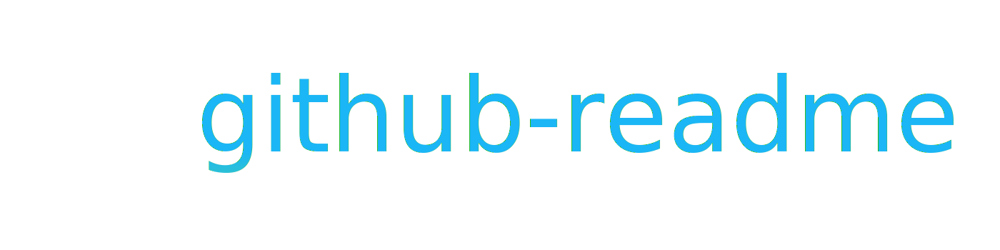

# 

 
 

Description paragraph here. Maybe illustration image or gif if relevant to show something visual. Emojis makes everything more fun! 🦊

## Table of Contents

- [template-readme](#template-readme)
	- [Table of Contents](#table-of-contents)
	- [Example how to use project / Usage](#example-how-to-use-project-usage)
	- [Gettings started / Installation](#gettings-started-installation)
	- [Related](#related)
	- [Release history](#release-history)
	- [Acknowledgements](#acknowledgements)
	- [Contributors](#contributors)
	- [License](#license)

## Example how to use project / Usage

## Gettings started / Installation

## Related

* [related-project](http://github.com/eivindml/) – Description of project

## Release history

## Acknowledgements

## Contributors

## License

MIT © [Eivind Mikael Lindbråten](http://madebymist.com)